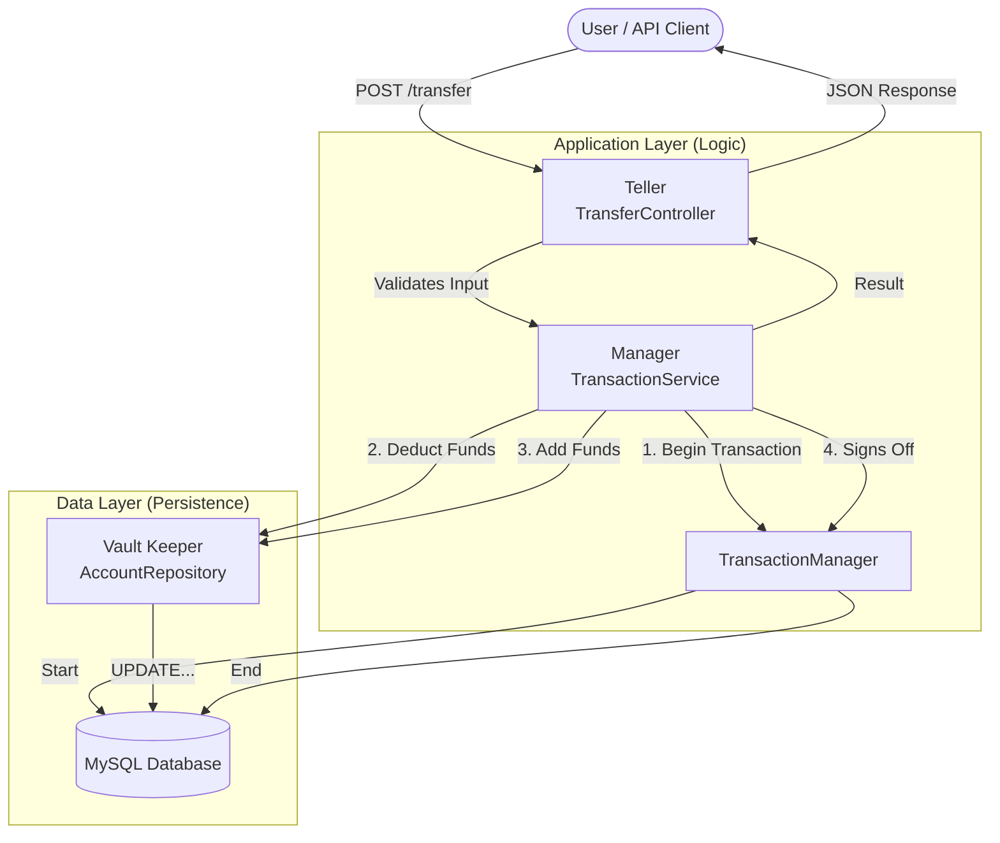

# Grit Ledger

**Grit Ledger** is a backend simulation of a transactional banking system. It solves a specific financial problem: **"How do we ensure money is never lost during a system failure?"**

This service implements a strict **ACID-compliant** architecture to handle funds. It guarantees **Atomicity**, meaning either the whole transfer happens, or none of it does.

## How to Run

This project is fully containerized. You do not need to install PHP, Composer, or MySQL on your local machine to run it.

###  Prerequisites
   ***Docker Desktop:** Ensure you have Docker installed and the container is running.*

1. Start the Application
   Open your terminal (Command Prompt, PowerShell, or Terminal) in this project folder.

2. Highlight, copy, and run the following command to build the environment: 
   * `docker-compose up --build`

*Wait for the logs to stop moving. You should see a message saying **"ready for connections"**.*

#### The API is now live.

## How to Test the API
I have provided two easy ways to test that the system works.

### Option 1: One-Click Test via Postman (Recommended)
I have included a testing file named **postman_collection.json** in the root directory of this project.

**Step 1:** Open Postman (or a similar tool like Insomnia).

**Step 2:** Click File > Import.

**Step 3:** Drag and drop the postman_collection.json file into the window.
           *You will see a new collection named **"Grit Ledger API"**.*

**Step 4:** Click the "Transfer Money" request and hit the blue Send button.
           *You should receive a success message confirming the transaction.*

### Option 2: Test via Terminal
If you prefer using the command line, open a new terminal window and run this command:

**For Windows (PowerShell) highlight and copy the command below:** 
 * `Invoke-RestMethod -Uri "http://localhost:8000/transfer" -Method Post -ContentType "application/json" -Body '{"sourceId": 1, "targetId": 2, "amount": 100}'`

**For Mac/Linux (Bash) highlight and copy the command below:** 
 * `url -X POST http://localhost:8000/transfer -H "Content-Type: application/json" -d '{"sourceId": 1, "targetId": 2, "amount": 100}'`

### How to Stop the application
Simply go back to your first terminal window and press **Ctrl + C**.

## Technical Decisions

I made these technical choices to ensure reliability and maintainability.

* **Strict Typing (PHP 8.2):** I defined all function arguments and return types explicitly to enforce type safety.
* **PDO (PHP Data Objects):** I used PDO for database interactions to support named parameters and database flexibility.
* **Dependency Injection:** I manually injected dependencies to improve testability and demonstrate Inversion of Control without heavy frameworks.
* **Custom Exception Handling:** I implemented specific exceptions like `InsufficientFundsException` to return meaningful HTTP status codes.

## Implementation Plan

This is how I built the system:

* **Step 1:** Created the Account model and SQL schema.
* **Step 2:** Built the Repository to handle database operations using PDO.
* **Step 3:** Implemented the Service logic with transaction management (begin, signs off, rollback).
* **Step 4:** Developed the Controller to handle HTTP requests and responses.

## Architecture & Design

I followed the **Separation of Concerns** principle to ensure each component has a single responsibility.

### The "Bank Vault" Analogy
To understand the flow, visualize the service as a physical bank operation:

1.  **The Teller (`TransferController`):** The entry point. Validates the transfer slip (Request) and delegates the work.
2.  **The Branch Manager (`TransactionService`):** The decision maker. Opens a transaction session, instructs the movement of funds, and signs off.
3.  **The Vault Keeper (`AccountRepository`):** The only one allowed to touch the database (Raw SQL via PDO).
4.  **The Ledger (`TransferDTO`):** A strict, typed object that carries transfer details safely between layers.

### System Flow Diagram

